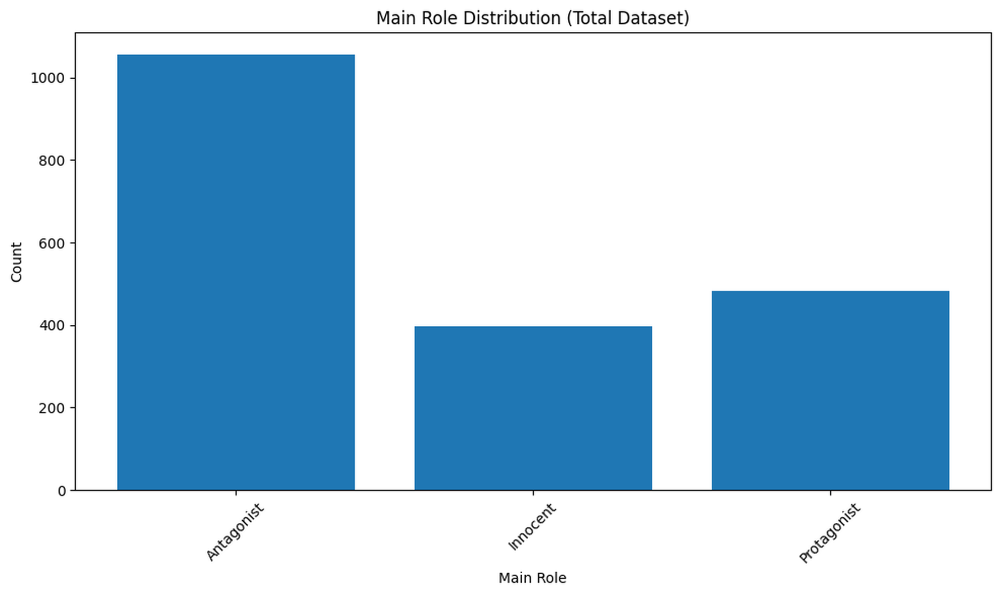
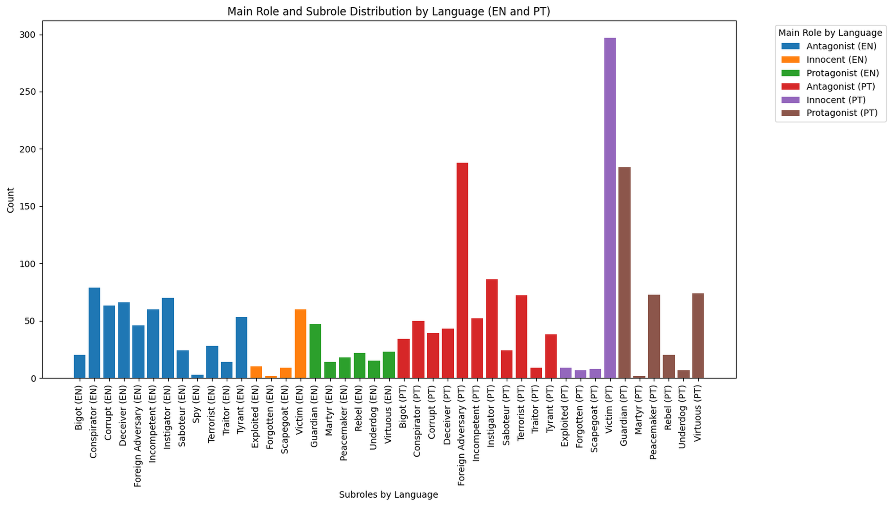

# **Entity Framing in Narratives: Multi-Label Role Classification of Named Entities**

This codebase is part of the project **"Entity Framing in Narratives: Multi-Label Role Classification of Named Entities"**, conducted for the **"Introduction to Natural Language Processing"** course at the **University of Bonn** during the **Winter 24/25 semester**.  
The problem is a part of **[SemEval 2025 Task 10](https://propaganda.math.unipd.it/semeval2025task10/)**.

---

## **Project Overview**
The goal is to classify named entities in texts into one of three **main roles**. Additionally, each main role has associated **fine-grained subroles** that need to be predicted, making this a **multi-class, multi-label classification problem**.

### **Main Roles and Subroles**
| **Main Role**   | **Subroles**                                                                                                                 |
|-----------------|------------------------------------------------------------------------------------------------------------------------------|
| **Protagonist** | Instigator, Conspirator, Tyrant, Foreign Adversary, Traitor, Spy, Saboteur, Corrupt, Incompetent, Terrorist, Deceiver, Bigot |
| **Antagonist**  | Guardian, Martyr, Peacemaker, Rebel, Underdog, Virtuous                                                                      |
| **Innocent**    | Forgotten, Exploited, Victim, Scapegoat                                                                                      |

Most existing approaches address either **multi-class** or **multi-label** tasks separately. This project explores models that tackle both tasks simultaneously.

---

## **Approach**
- Fine-tuning **[LLaMA-3.2-3B-Instruct](https://huggingface.co/meta-llama/Llama-3.2-1B-Instruct)** using **pre-constructed prompts** for multi-label classification.

---

## **Data Description**
The dataset is provided by **[SemEval 2025 Task 10](https://propaganda.math.unipd.it/semeval2025task10/data/target_4_December_release.zip)**.  
This project uses **English (EN)** and **Portuguese (PT)** data, partitioned as follows:
- **Training Set:** 70%
- **Validation Set:** 15%
- **Test Set:** 15%

Processed data is stored in the **[Dataset_EN_PT directory](Llama_3B_Instruct_with_Pre-constructed_Prompts/Dataset_EN_PT)**.

---

### **Annotation Format**
- **Train/Validation Files:**  
  `train.csv`, `val.csv` – [article_id, entity_mention, start_offset, end_offset, main_role, fine_grained_roles]
- **Test File:**  
  `test.csv` – [article_id, entity_mention, start_offset, end_offset]

### **Raw Texts**  
The **[raw-documents_EN_PT](Llama_3B_Instruct_with_Pre-constructed_Prompts/Dataset_EN_PT/raw-documents_EN_PT)** directory holds the combined raw text files for both English and Portuguese.

---

## **Data Distribution**

### **Main Role Distribution**

### **Sub Role Distribution**

---

